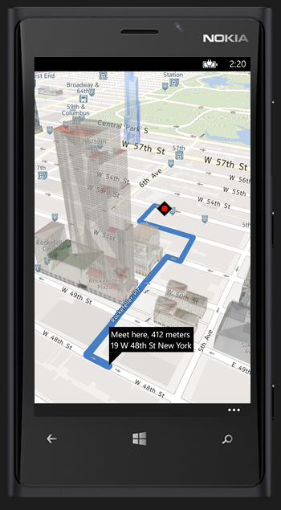

# RoundUp

Windows Phone 8 Geolocation App

**Archived Visual Studio 2013 project that was previously held in Team Foundation Server.**

**Having been available free from the Windows app store since September 2013, as of May 21st 2016 this app has been removed from the Windows app store.**

With roundup, you can send your friends an invite to meet at your location. You can see them on the map, and they can see your location and follow walking or driving directions to find you.

## Sharing your location is easy

The new share panel makes it quick and easy to share your location with friends, even if they don't have roundup, or a Windows phone. When a friend accepts your invite, you can track their progress on the map.

## Using roundup is secure

Only friends who receive your unique invite (via SMS, email, etc.) can see your location. Joining a roundup session is by invitation-only, so nobody can track your location without your permission. Your location is never revealed to anyone you haven't sent an invite to, or accepted an invite from.

## Share your location with any smartphone

Now you can share your location with friends who don't have roundup or a Windows phone. With a single tap you can quickly and easily share your location via Bing maps.
